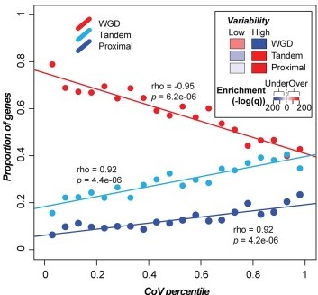
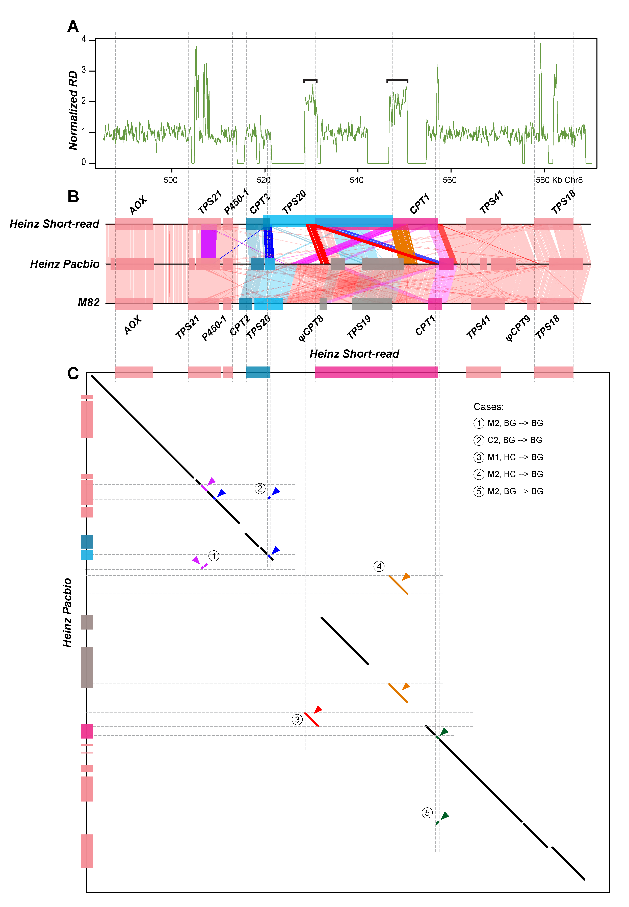

## I am interested in questions about the evolution of plants, genes, plant genomes and transcriptomes.

**Why are the structures of spiral flowers flexible?**
 
Using *Nigella damascena* (love-in-a-mist) as a model system, we revealed that the expression profiles of floral organ identify genes are dynamic, and the genes regulate the boundaries between different types of floral organs by forming a complex regulatory network. Notably, the *AGL6*-lineage member *NdAGL6* is an A-function gene determining the identity of sepal and petal, rather than the *AP1*-lineage genes as in *Arabidopsis thaliana*. These results have been published in *Nature Plants*. [pubmed](https://pubmed.ncbi.nlm.nih.gov/27250746/)

**How do gene family sizes vary among related plant species?**
 
Using the Solanaceae family as a model and Pfam domain families as a proxy for gene families, our findings reveal complex relationships between variation in gene family size, gene functions, duplication mechanism, and evolutionary rate: 1) genes in highly variable families have high turnover rates and tend to be involved in processes that have diverged between Solanaceae species, whereas genes in low-variability families tend to have housekeeping roles; 2) genes in high and low-variability gene families tend to be duplicated by tandem and whole genome duplication, respectively; 3) genes duplicated by different mechanisms experience different selection pressures. In addition, we found that a substantial number of pseudogenes are actually products of pseudogene duplication, contrary to the expectation that most plant pseudogenes are remnants of once-functional duplicates. These results can be available in *Genome Biol Evol*. [pubmed](https://pubmed.ncbi.nlm.nih.gov/30239695/)

**What factors influence read coverage in a genome assembled using short reads?**
 
In tomato, 0.6% (5.1 Mb) and 9.7% (79.6 Mb) of short-read based assembly had significantly higher and lower coverage compared to background, respectively. We first established machine learning models capable of predicting genomic regions with variable coverages and found that high coverage regions tend to have higher simple sequence repeat and tandem gene densities compared to background regions. We also found that 27.8% (1.41 Mb) of high coverage regions were potentially misassembled of duplicate sequences, compared to 1.4% in background regions. In addition, misassembled, high coverage regions tend to be flanked by simple sequence repeats, pseudogenes, and transposon elements. Our study provides insights on the causes of variable coverage regions and a quantitative assessment of factors contributing to plant genome misassembly when using short reads. These results have been published in *BMC Genomics*. [pubmed](https://pubmed.ncbi.nlm.nih.gov/33530937/)

**How well can the gene expression data be used to predict metabolic pathway memberships?**
To optimize the use of gene expression data to predict plant metabolic pathway memberships, we explored >600 tomato expression data combinations, three strategies for predicting memberships in 85 pathways. We found that optimal predictions for different pathways require distinct data combinations indicative of pathway functions. Unsupervised learning performed better than supervised approaches, while gene-to-pathway expression similarities led to prediction models that outperformed those based simply on expression levels. Predictions for experimental validated genes is significantly better than that for genes without experimental evidence, demonstrating the importance of data quality. Our study highlights the need to extensively explore expression-based features and prediction strategies to maximize the accuracy of metabolic pathway membership assignment. These results have been accepted by *New Phytologist*. [accepted](https://nph.onlinelibrary.wiley.com/doi/10.1111/nph.17355)

