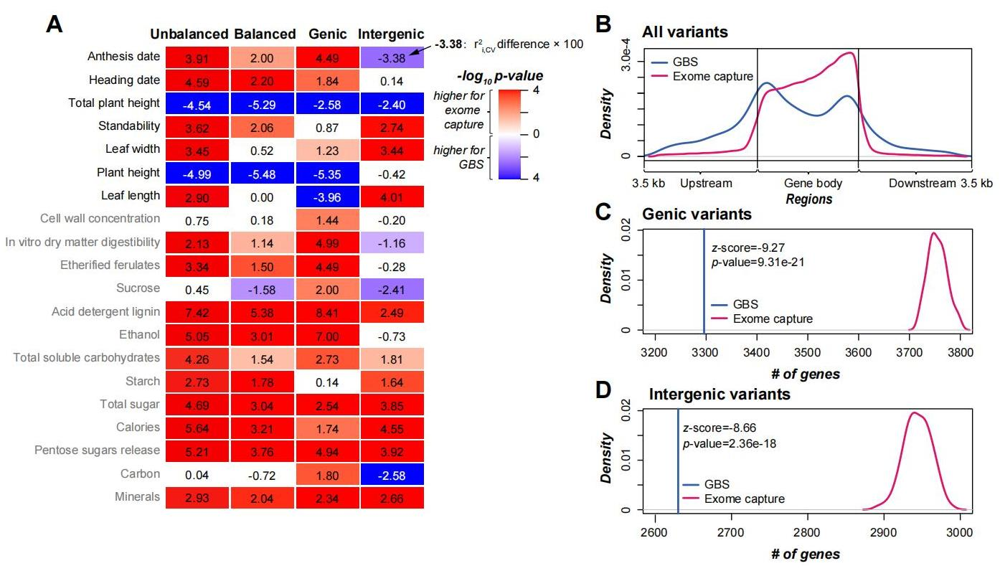
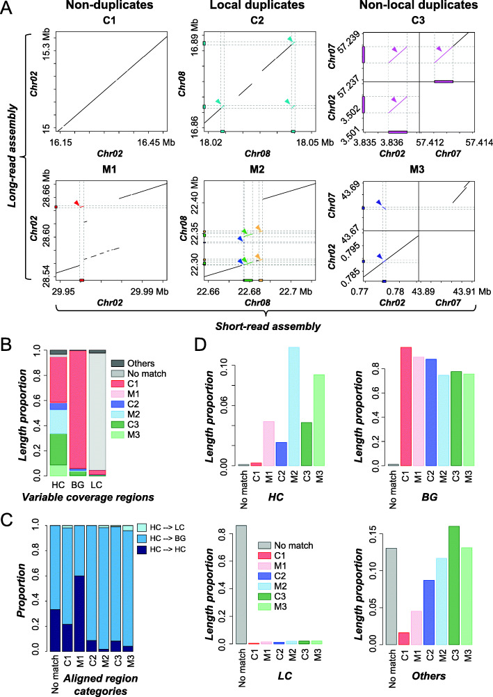

## I am generally interested in questions about the evolution of plants, genes, plant genomes and transcriptomes, and the predictive biology using machine learning. 
**What are the effects of genome assemblies, genotyping approaches, genetic variant types, population structures on genomic prediction?**
<a href="https://oup.silverchair-cdn.com/oup/backfile/Content_public/Journal/plphys/198/3/10.1093_plphys_kiaf188/1/m_kiaf188f3.jpeg?Expires=1758054615&Signature=BrkbDeKyy8DHoErwkuHr4Zjn15XtLiT~ErPXixYE9-0867IztUK4lpbYzNRamRV38ub1O4k6e-yCipoTJ6iqYCapnbghbP6aaFw1FlmeBq7YIjRaBZF2TkM~MVM4PBdtebof6OtxNeL~5sSRk3oa6vr-uKjs1HOP9T0MaTWuJZooVvDmJrQxFfQApJ0LBIU2F8MyCdkUWBQ93LYSgROg-v66GwDdipRroPhkGzECAmk1eXqS9AXKDAh9KaAo4xnwQqTfIBwzZF-~MiA4bsn8klmeStwL-3j68b~p5mFOCZAPewqX3mobiJ4tfGg3JDZE4976iijZ-bxFFdYlVERmRw__&Key-Pair-Id=APKAIE5G5CRDK6RD3PGA"></a> 
When predicting 20 complex traits in switchgrass (*Panicum virgatum* L.), a perennial biofuel feedstock, we found that short read-based genome assembly performs comparably to or even better than long read-based assembly; due to higher gene coverage, exome capture and multi-allelic variants outperform genotyping-by-sequencing and bi-allelic variants, respectively; tetraploid models show higher prediction accuracy than octoploid models for most traits, likely due to the greater genetic distances among tetraploids. These results have been published in ***Plant Physiol***. [pubmed](https://pubmed.ncbi.nlm.nih.gov/40331363/)

**How do transcriptome and methylome contribute to trait prediction?**
 
Transcriptome- and methylome-based models had performances comparable to those of genome-based models in *Arabidopsis thaliana*, but identified different benchmark genes. Gene contributions to flowering time prediction are accession-dependent and distinct genes contribute to trait prediction in different genotypes. Models integrating multi-omics data perform best and reveal known and additional gene interactions, extending knowledge about existing regulatory networks underlying flowering time determination. These results have been published in ***Nat Commun***. [pubmed](https://pubmed.ncbi.nlm.nih.gov/39127735/)

**Why are the structures of spiral flowers flexible?**
 
Using *Nigella damascena* (love-in-a-mist) as a model system, we revealed that the expression profiles of floral organ identify genes are highly dynamic, and the genes regulate the boundaries between different types of floral organs by forming a complex regulatory network. Notably, the *AGL6*-lineage member *NdAGL6* is an A-function gene determining the identity of sepal and petal, rather than the *AP1*-lineage genes as in *Arabidopsis thaliana*. These results have been published in ***Nat Plants***. [pubmed](https://pubmed.ncbi.nlm.nih.gov/27250746/)

**How can we measure Arabidopsis fitness efficiently?**
 Using the Faster Region-based Convolutional Neural Network (R-CNN) algorithm, we established the image recognition models for Arabidopsis seeds and fruits, which yielded near perfect counts (r2 = 0.9996 and 0.980, respectively). These results have been published in ***New Phytol***.[pubmed](https://pubmed.ncbi.nlm.nih.gov/35218008/)

**How well can the gene expression data be used to predict metabolic pathway memberships?**
 
To optimize the use of gene expression data to predict plant metabolic pathway memberships, we explored >600 tomato expression data combinations, three strategies for predicting memberships in 85 pathways. We found that optimal predictions for different pathways require distinct data combinations indicative of pathway functions. Unsupervised learning performed better than supervised approaches, while gene-to-pathway expression similarities led to prediction models that outperformed those based simply on expression levels. Predictions for experimental validated genes is significantly better than that for genes without experimental evidence, demonstrating the importance of data quality. Our study highlights the need to extensively explore expression-based features and prediction strategies to maximize the accuracy of metabolic pathway membership assignment. These results have been published in ***New Phytol***. [pubmed](https://pubmed.ncbi.nlm.nih.gov/33749860/)

**How do gene family sizes vary among related plant species?**
 
Using the Solanaceae family as a model and Pfam domain families as a proxy for gene families, our findings reveal complex relationships between variation in gene family size, gene functions, duplication mechanism, and evolutionary rate: 1) genes in highly variable families have high turnover rates and tend to be involved in processes that have diverged between Solanaceae species, whereas genes in low-variability families tend to have housekeeping roles; 2) genes in high and low-variability gene families tend to be duplicated by tandem and whole genome duplication, respectively; 3) genes duplicated by different mechanisms experience different selection pressures. In addition, we found that a substantial number of pseudogenes are actually products of pseudogene duplication, contrary to the expectation that most plant pseudogenes are remnants of once-functional duplicates. These results can be available in ***Genome Biol Evol***. [pubmed](https://pubmed.ncbi.nlm.nih.gov/30239695/)

**What are the factors influencing read coverage and misassembly in a genome assembled using short reads?**
 
In tomato, 0.6% (5.1 Mb) and 9.7% (79.6 Mb) of short-read based assembly had significantly higher and lower coverage compared to background, respectively. We first established machine learning models capable of predicting genomic regions with variable coverages and found that high coverage regions tend to have higher simple sequence repeat and tandem gene densities compared to background regions. We also found that 27.8% (1.41 Mb) of high coverage regions were potentially misassembled of duplicate sequences, compared to 1.4% in background regions. In addition, misassembled, high coverage regions tend to be flanked by simple sequence repeats, pseudogenes, and transposon elements. Our study provides insights on the causes of variable coverage regions and a quantitative assessment of factors contributing to plant genome misassembly when using short reads. These results have been published in ***BMC Genomics***. [pubmed](https://pubmed.ncbi.nlm.nih.gov/33530937/)

